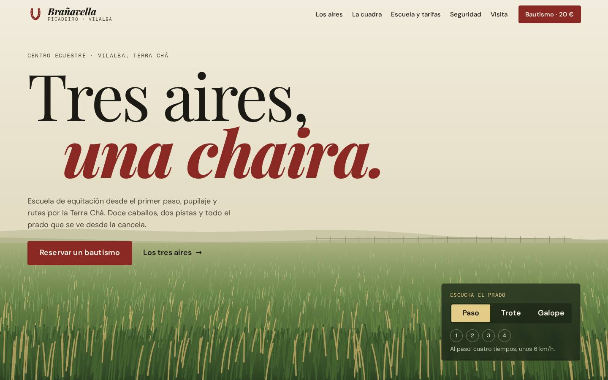

# Picadeiro Brañavella — plantilla de demostración

> **Sitio de demostración. Picadeiro Brañavella es un negocio ficticio; los
> datos, ilustraciones y opiniones son de muestra.** No existe ningún centro
> ecuestre con este nombre en Vilalba ni en la dirección que figura en la web
> (Camiño das Cancelas, 7 es inventada). Teléfonos de ejemplo, correo en
> `.example`. Todas las páginas llevan `noindex, nofollow`.

Plantilla de la biblioteca de negocios ficticios para el sector **centro
ecuestre / hípica**. HTML + CSS + un `main.js`, sin build. GSAP, ScrollTrigger y
Lenis desde **jsDelivr**.



## Concepto: «Aires»

> El caballo tiene tres aires, y cada uno suena distinto.

En equitación, los **aires** son el paso, el trote y el galope. Lo que de verdad
los distingue no es la velocidad, es **el compás**: el paso tiene cuatro
golpes, el trote dos (en diagonal) y el galope tres y un instante en el aire.
Aprender a montar es aprender a ir con ese compás. Y en la Terra Chá, «aire»
es también el viento que peina el prado.

De esa doble lectura sale todo:

- la **portada** es el prado de la Chaira, en canvas: el viento lo mueve, el
  cursor lo aparta y **un caballo que no se ve lo cruza**; cada golpe de casco
  abre una onda en la hierba al compás del aire que elijas (paso, trote o
  galope), y los números del 1 al 4 se encienden con cada golpe;
- la **secuencia anclada** es un **diagrama de apoyos** de las cuatro patas que
  pasa del paso al trote y al galope con el scroll, con el orden de los golpes,
  el instante de suspensión y un cursor que recorre la zancada en bucle;
- la **cinta** repite los compases (1·2·3·4 · 1·2 · 1·2·3);
- la **cortina** es la puerta de la cuadra, de dos hojas: primero se abre la de
  arriba y después la de abajo;
- las secciones **entran por listones**, como una cancela que se abre.

## Qué hace esta mejor que las anteriores

Revisadas antes de diseñar las fichas de **As Caldeiras** (balneario),
**Casa Bricaña** (hotel rural, «Orballo»), **CARRIL DEZ** (autoescuela,
«Carril») y **VINTE QUILOS** (gimnasio, «Carga»):

1. **El hero es un paisaje con un personaje invisible.** Casa Bricaña empaña un
   cristal; aquí el prado (≈2 700 briznas a 1440 px, en 12 lotes de trazo por
   fotograma) responde a tres fuerzas: viento, cursor y **los cascos de un
   caballo que no se dibuja**. El ritmo de las ondas es el compás real de cada
   aire. El cielo, las colinas y la cerca se pintan una vez en un lienzo aparte
   y se copian; sin filtros ni sombras por fotograma.
2. **La narrativa anclada enseña un dato del oficio que nadie publica**: el
   diagrama de apoyos (tipo Hildebrand) con el orden de los golpes. Carril
   mueve un coche por un trazado; aquí lo que se anima es el **compás**, con las
   barras interpolándose entre aires y la suspensión del galope apareciendo.
3. **La cuadra se presenta por caballos, no por instalaciones**: ocho cabezas
   dibujadas con un solo símbolo SVG y la capa, la crin y las marcas en
   variables CSS; cada ficha dice para qué sirve ese caballo. La fila se
   arrastra con el ratón y solo es focusable si desborda.
4. **El horario está vivo** (hora de Vilalba): marca el día, dice si está
   abierto y hasta cuándo, o cuándo abre; el lunes explica que descansan los
   caballos.
5. **Medido y auditado**: `longtask` desde el `<head>`, axe a cero en seis
   estados, 46 comprobaciones automáticas, receta de borrado de los mandos como
   script probado en seis combinaciones.

## Mapa de secciones

| # | Pieza | Forma |
|---|---|---|
| — | Cortina | Puerta de cuadra roja de dos hojas con su cruz de refuerzo; giran en 3D (`rotationX`, `expo.inOut`), primero la de arriba |
| 1 | Portada | Prado en canvas a sangre; titular «Tres aires, una chaira.» sobre el cielo; selector de aire con los golpes contados |
| 2 | Cinta | Compases en Playfair cursiva y Fragment Mono, velocidad ligada al scroll |
| 3 | Los aires | Anclada (3 pantallas), oscura: diagrama de apoyos + tiempos y km/h en grande + etapa de la escuela |
| 4 | La cuadra | Fila arrastrable de ocho caballos en dos alturas, y el equipo en una frase |
| 5 | Escuela y tarifas | Bautismo (20 €) a la izquierda, tablón oscuro con pestañas (clases, rutas, pupilaje) a la derecha |
| 6 | Seguridad | Normas con herradura + preguntas en `<details>` (incluida «no hacemos hipoterapia») |
| 7 | Visita | Dirección, semana con el día de hoy marcado y estado en vivo, mapa dibujado que solo carga Google bajo clic, formulario de muestra |

## Paleta «chaira»

| Token | Valor | Uso |
|---|---|---|
| `--nata` | `#F3EEE1` | fondo principal |
| `--avena` | `#E6DCC3` | secciones alternas |
| `--prado` / `--prado-2` | `#1D2B1B` / `#283A25` | secciones oscuras, tablón, pie |
| `--heno` | `#E3CC88` | acento sobre oscuro (cifras, pestaña activa) |
| `--tinta` | `#1B1A14` | texto |
| `--apagado-nata` / `--apagado-avena` / `--apagado-prado` | `#585141` / `#4F4839` / `#B7C1A6` | texto secundario, uno por fondo |
| `--casaca` | `#8A2923` | marca: el rojo de la casaca de monta y de la puerta de cuadra |
| `--casaca-claro` | `#F2A08E` | la marca como texto o trazo sobre prado |

**23 parejas** calculadas con `scripts/contraste.js`: de 5,77:1 a 15,05:1;
botones ≥ 7,48:1. Alternativas del mando (**azul** `#22457C` y **ocre**
`#5E4710`) con la misma luminosidad y el matiz rotado.

## Tipografía

**Playfair Display** variable (400–900, con cursiva) para titulares: el
contraste alto de la tradición hípica, en cursiva 800 para el acento. **DM
Sans** para texto y **Fragment Mono** para compases, horas y cifras. Ninguna
sale en la biblioteca. Revisados €, ñ, tildes y « ».

## Recursos de movimiento (mínimo cinco; aquí nueve)

1. **Hero en canvas** propio e interactivo (cursor, selector de aire, scroll que levanta rachas) — *protagonista*.
2. **Secuencia anclada con scrub**: el diagrama de los tres aires.
3. **Lenis** como único motor de scroll.
4. **Char-reveal por trancos**: las letras entran inclinadas y por palabras, como un tranco.
5. **Marquee** de compases con velocidad y sentido ligados al scroll.
6. **Galería horizontal arrastrable** de caballos, con entrada escalonada al scroll.
7. **Botones magnéticos**.
8. **Cursor propio**: punto + aro, herradura sobre lo pulsable, «← →» sobre la cuadra, claro sobre fondos oscuros.
9. **Transición por listones** (máscara a medio abrir) entre secciones.

## Control de maqueta: «Aires» y «Sobria»

Solo con `?revision`. **Aires**: el compás y los dibujos en todas partes
(cabezas de caballo, golpes en la cinta, herraduras en las normas). **Sobria**:
el compás solo donde significa algo (prado y diagrama); las cabezas dejan sitio
a **la alzada en grande**, y añade una **comparativa de alzadas** de los ocho
caballos en barras (los valores salen de `data-alto`).

## Control de paleta: Casaca, Azul, Ocre

Mismo mando. Se guarda en `localStorage` (`branavella-paleta`,
`branavella-densidad`), se aplica en el script bloqueante del `<head>` y el
aviso de cookies y el aviso legal lo dicen. El logo no cambia.

### Receta de borrado de los mandos

**El mando NUNCA viaja al sitio de un cliente.**

```sh
node scripts/quita-mandos.js --densidad=aires --paleta=casaca --destino=../branavella-cliente
```

`--densidad` `aires` o `sobria`; `--paleta` `casaca`, `azul` u `ocre`. Quita,
con anclas exactas y comprobando cada escritura: el bloque `MANDOS DE
DEMOSTRACIÓN` del `<head>` y el `MANDO DE DEMOSTRACIÓN` del `<body>` y del
`main.js`; la frase de modo revisión del aviso de cookies; las paletas (y
escribe la elegida en `:root`); el CSS del mando; con `aires`, la comparativa
y el bloque de la versión sobria; con `sobria`, deja la clase fija en
`<html>`; y la línea de las claves de demo en `legal.html`. Comprueba que
`main.js` compila y que no queda rastro. Probada en las seis combinaciones el
2026-10-02; dos copias cargadas en el navegador sin errores.

## Reskinear para un centro real

1. **Datos** en `index.html`: nombre, dirección, teléfonos, correo, `schema.org`
   (sin valoraciones), y el `q=` del mapa en `main.js` (`maps?q=`).
2. **Horario**: la lista `.semana` (texto) y la tabla `TURNOS` de `main.js`
   (minutos desde medianoche por día; `0` es domingo). Las dos a la vez.
3. **Caballos**: cada `<li class="caballo">` lleva `--capa`, `--crin` y
   `--marca` (o `transparent`) en el `style`, y `data-alto` en cm para la
   comparativa. El dibujo es un único `<symbol id="cabeza">`.
4. **Tarifas**: las tres pestañas del tablón. Quita «Precios de muestra,
   ficticios» solo con precios reales.
5. **Los aires**: `AIRES` (portada: periodo, velocidad, golpes) y `G` (diagrama:
   inicio y duración del apoyo de cada pata) en `main.js`. Son valores
   aproximados de libro de equitación, no mediciones.
6. **Paleta**: `--casaca` y familia en `:root`, y `node scripts/contraste.js`.
7. **og:image**: `scripts/og.html` → `node scripts/og.js`.
8. **Antes de publicar**: `node scripts/verifica.js` y `node scripts/axe.js`.

## Comprobaciones

`scripts/contraste.js` (23 parejas), `scripts/verifica.js` (capturas en
1440×900 y 390×844 y 46 comprobaciones del §7), `scripts/axe.js` (escribe
`AUDITORIA.md`) y `scripts/quita-mandos.js`. Con la carpeta servida en
`http://localhost:8765/`. La hora se fija con `?ahora=2026-10-01T18:10`.

## Créditos y decisiones

Sin fotografía: todo es SVG o canvas propio (ver [`CREDITOS.md`](CREDITOS.md)).

- **Sin fotos de caballos**: un centro real tendrá las suyas; las de archivo
  serían caballos de otros. Las cabezas dibujadas se recolorean por variables
  y sirven de marcador hasta que lleguen las fotos.
- **Ninguna terapia**: hay una pregunta entera que dice que no se hace
  hipoterapia, y el aviso legal lo repite.
- **Sin registros inventados**: ni núcleo zoológico ni explotación equina; el
  aviso legal dice dónde irían.
- **Peso máximo y edades** en las normas, por seguridad y bienestar animal;
  nada de menores en imagen (las ilustraciones son caballos).
- **Lunes cerrado**, explicado: descansan los caballos.
