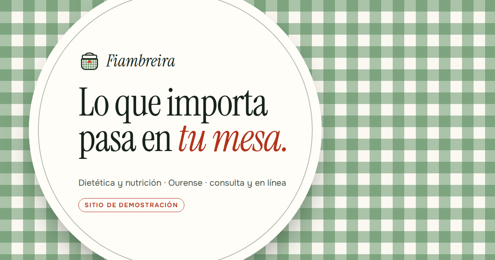

# Fiambreira · consulta de nutrición (plantilla)

> **Sitio de demostración.** Fiambreira es un negocio **ficticio**: las
> personas, la dirección, los teléfonos, el correo, las tarifas y los números
> de colegiación y de registro sanitario son de muestra y no corresponden a
> nadie. Todas las páginas llevan `noindex, nofollow`.

Plantilla de la biblioteca de webs de negocios ficticios para el sector
**dietista-nutricionista**, situada en **Ourense** (Rúa do Pementeiro, 7;
calle inventada). Registro luminoso de mediodía: mantel, loza, mercado.
HTML + CSS + un `main.js`, sin build. GSAP, ScrollTrigger y Lenis desde
**jsDelivr**.

- Ver en local: `node scripts/servidor.js 8765` → <http://localhost:8765/plantilla-nutricion-web/>
  (sirve la carpeta padre, como GitHub Pages, porque el `404.html` usa rutas absolutas).
- Mandos de demostración (versión y color): añadir `?revision` a la URL.

## El concepto: «Mantel»

Lo que importa pasa en tu mesa, no en una hoja de dieta. Un dietista que
trabaja bien no reparte menús de 1.200 calorías: mira lo que ya comes, quién
cocina y qué se compra, y cambia eso. El mantel de cuadros es la mesa de casa
de todo el mundo, y es también el sistema visual: el vichy sale en la portada
(WebGL), en la cortina (una servilleta que se dobla), en la mesa que se pone
paso a paso, en el marco de la carta y en el logo. El nombre, *fiambreira*,
es la tartera gallega: la comida que te llevas de casa.

Comprobado contra el PLIEGO §3 y las fichas de `registro/`: «Mantel» está
libre, ninguna plantilla usa vichy ni WebGL de tela.

## Qué hace esta mejor que las anteriores

Revisadas antes de diseñar: **Orballo** (hotel rural, canvas de vaho),
**Carga** (gimnasio, galería horizontal anclada), **La miga** (panadería,
canvas y galería de seis cortes) y **Ramo** (floristería, montaje paso a paso).

1. **El primer WebGL de la biblioteca que es una superficie que se toca.** Las
   portadas con canvas de la biblioteca son 2D (vaho, burbujas, magnesio). Aquí
   un shader de fragmentos pinta el vichy sobre una tela con pliegues, con
   iluminación por normales; donde pasas la mano la tela **se hunde y se
   arruga en estrella**, y vuelve a alisarse sola; un toque deja una onda; el
   scroll tira del mantel y lo alisa. Sin WebGL, el mismo vichy en CSS.
2. **Dos escenas ancladas con oficio distinto, no una galería genérica.** «Poner
   la mesa» monta una mesa vista desde arriba pieza a pieza (servilleta, plato,
   vaso, cubiertos, frutero, jarra), y cada pieza es un paso del proceso, de la
   primera llamada al alta. «Qué hay cada mes» es una galería horizontal con
   los doce meses de la plaza de abastos, **con el mes actual marcado** por
   fecha (también sin JS de movimiento).
3. **El sector sanitario resuelto con un recurso propio.** «Lo que aquí no vas
   a encontrar» es una lista de la compra que **se tacha al leerla** (dietas de
   1.200, batidos, kilos en una fecha, prohibidos…). La tachadura es contenido:
   sin JS o con movimiento reducido ya está tachada.
4. **Rendimiento medido y corregido.** La primera versión del shader daba
   tareas largas continuas de ~55 ms en el Chromium sin GPU del arnés; se bajó
   el búfer al 70 % del tamaño CSS (el vichy lleva su propio antialias) y se
   pinta a 20 fps cuando la tela está en reposo. Resultado: 0 tareas largas al
   hacer scroll y 61 fps, también con la CPU a ×4 en móvil.
5. **Verificación por script.** 55 comprobaciones (`scripts/verificar.js`),
   incluida la tela (presión > 0,3 al pasar la mano, onda al tocar, vuelta al
   reposo), la galería horizontal recorrida en pasos de 90 px (44 en escritorio, 47 en móvil) sin un solo retroceso, la
   cortina en tres modos, las dos densidades y las tres paletas; axe sin
   violaciones; receta de borrado aplicada sobre copia en las dos direcciones.

## Mapa de secciones

| # | Sección | Forma |
|---|---|---|
| — | Cortina | servilleta de vichy que se dobla dos veces en diagonal y se retira a la esquina |
| 1 | Portada | mantel WebGL a sangre; el texto va **en un plato** (círculo de loza con su filete); tira de datos abajo |
| 2 | Lo que no | titular pegajoso a la izquierda, lista de seis «no» que se tachan a la derecha |
| 3 | Poner la mesa | escena anclada en verde noche: mesa SVG, contador «1 de 6», paso activo |
| 4 | La carta | carta de restaurante con seis consultas, precios con puntos guía, marco de vichy |
| 5 | Qué hay cada mes | galería horizontal anclada, doce meses con icono propio, barra de avance |
| 6 | Dos personas a la mesa | dos platos-monograma desfasados |
| 7 | Preguntas de sobremesa | `
` con respuesta que se despliega |
| 8 | Contacto | titular enorme, datos y horario vivo, mapa bajo clic, formulario |

## Paleta, tipografía y movimiento

- **Paleta «mantel»**: blanco de mantel `#FAF8F1` / panel `#EFEBDD` / loza
  `#FFFDF8` / tinta verde noche `#172419` / apagada `#4E5A50` / noche
  `#1C3322` y `#142619` / niebla `#CBD8CC` / **albahaca** de superficie
  `#3E7A45` y honda para botones y texto `#245A2D` / tomate `#D8462B` y su
  token de texto `#B1341C` / limón `#EEC643` / agua `#BFD9DE`.
- **Tipografía**: **Instrument Serif** (con cursiva) para titulares, a tamaño
  de cartel (hasta 8 rem); **Onest** variable para el texto.
- **Movimiento protagonista**: el mantel WebGL de la portada.
- **Recursos del §2** (aquí 8): Lenis (`lerp` 0,16 por la galería
  horizontal); char-reveal; escena anclada con scrub; galería anclada con
  desplazamiento horizontal; botones magnéticos; cursor propio (dice «alisa»
  sobre el mantel y «mapa» sobre el mapa); hero WebGL; tachaduras que se
  dibujan al entrar.
- **Easing**: una curva de «posar» (`cubic-bezier(.33,.9,.25,1)`) y
  `expo.inOut` para la cortina y el menú.

## Los mandos de demostración (`?revision`)

- **Versión**: **Mantel** (la cargada) / **Sobria**. La sobria deja el vichy
  donde significa algo (logo, cortina, portada, la mesa y los platos del
  equipo) y quita el marco de la carta, las franjas entre secciones y los doce
  iconos de la temporada. **Cambia dibujo por dato** (precios a 2,6 rem, meses
  más grandes) y **añade** una tabla comparativa: qué incluye cada consulta
  (primera, seguimiento, en línea).
- **Color**: **Albahaca** (la real), **Loza** (+100°, azul) y **Ocre** (−75°),
  rotando el matiz en OKLCH y conservando la luminosidad. El mantel WebGL lee
  el color del CSS, así que cambia también. Papel, tinta, tomate y **logo** no
  cambian.

Se recuerdan en `localStorage` (`fiambreira-maqueta`, `fiambreira-paleta`), se
aplican en el script bloqueante del `<head>`, el mando se aparta mientras el
aviso de cookies está en pantalla y el aviso legal lo cuenta.

### Borrar los mandos (antes de entregar a un cliente)

Marcadores: `MANDO-INICIO` … `MANDO-FIN`, líneas que acaban en `// MANDO`,
`SOBRIA-INICIO` … `SOBRIA-FIN` y `MANTEL-INICIO` … `MANTEL-FIN`.

1. Borrar cada tramo `MANDO-INICIO` … `MANDO-FIN` en `index.html` (3),
   `legal.html` (1), `css/estilos.css` (2) y `js/main.js` (2).
2. Borrar en `js/main.js` la línea que termina en `// MANDO`.
3. Si el cliente se queda **Mantel**: borrar los tramos `SOBRIA-INICIO` …
   `SOBRIA-FIN` (1 en `index.html`, 1 en `css/estilos.css`) y, en el tramo
   `MANTEL-INICIO` … `MANTEL-FIN` del CSS, quitar el prefijo
   `html:not(.maqueta-sobria) ` y los marcadores.
   Si se queda **Sobria**: borrar el tramo `MANTEL-INICIO` … `MANTEL-FIN` y
   quitar el prefijo `html.maqueta-sobria ` de las reglas del tramo de la
   sobria.
4. Comprobar: `node scripts/borrar-mandos.js mantel` (o `sobria`) hace lo
   mismo sobre una copia, busca rastros y la carga en Chromium. Con
   `--aplicar <carpeta>` deja el resultado listo para entregar.

Comprobado por script contra estos mismos archivos, en las dos direcciones.

## Reskinear para una consulta real

1. **Datos** (`index.html`, `legal.html`, `404.html`): nombre, personas,
   colegiaciones reales (quitar «de muestra»), registro sanitario, dirección,
   teléfono, correo, horario, tarifas. JSON-LD del `<head>` sin `aggregateRating`.
2. **Horario en vivo**: tabla del HTML **y** objeto `tramos` de `js/main.js`.
3. **Mapa**: consulta del iframe en `js/main.js` y dibujo de `.mapa-dibujo`
   (el río es el Miño).
4. **Temporada**: los doce `<li class="mes">` (producto local del cliente) y
   sus iconos `<symbol>` al final de la sección.
5. **Color**: tokens de `:root`; el shader los lee del CSS. Pasar
   `node scripts/contraste.js`.
6. **Logo y favicon**: `img/logo.svg`, `img/favicon.svg`; luego
   `node scripts/imagenes.js` (plantilla de la imagen social en `scripts/og.html`).
7. **Ruta del 404**: `/plantilla-nutricion-web/` en rutas absolutas.
8. **Mandos**: borrarlos (arriba).
9. Mantener: sin promesas de peso, sin dietas milagro, sin testimonios ni
   «antes y después», y el aviso de que no se diagnostica.

## Verificación

`node scripts/verificar.js` con `scripts/servidor.js` en marcha. Números en
[`INFORME-NOCHE.md`](INFORME-NOCHE.md), auditoría en
[`AUDITORIA.md`](AUDITORIA.md), capturas en `screenshots/`. El arnés sirve
GSAP/Lenis desde npm y las fuentes desde una caché de `curl` (en el entorno de
construcción jsDelivr estaba bloqueado); **la web publicada apunta a los CDN
reales**.

## Créditos

Cero fotografía: SVG y WebGL propios. Ver [`CREDITOS.md`](CREDITOS.md).
