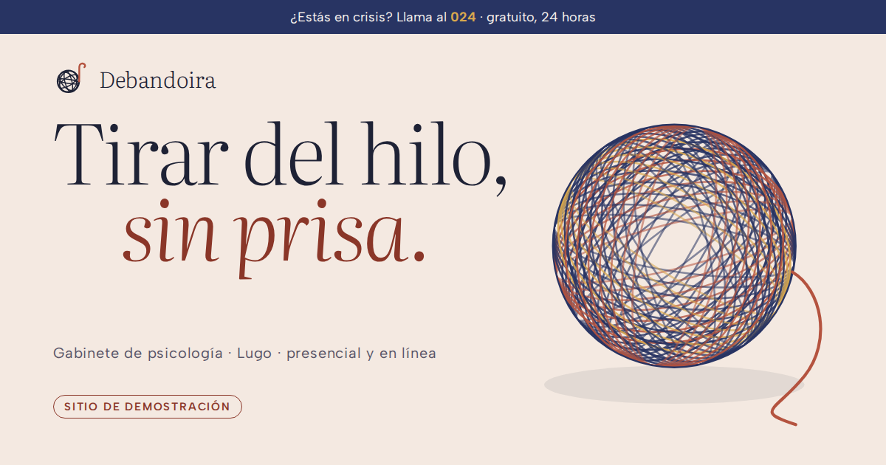

# Debandoira · gabinete de psicología (plantilla)

> **Sitio de demostración.** Debandoira es un negocio **ficticio**: las personas,
> la dirección, los teléfonos, el correo, las tarifas y los números de
> colegiación y de registro sanitario son de muestra y no corresponden a nadie.
> El único dato real es el **024** (línea pública de atención a la conducta
> suicida en España), y está puesto a propósito. Todas las páginas llevan
> `noindex, nofollow`.

Plantilla de la biblioteca de webs de negocios ficticios para el sector
**gabinete de psicología**, situada en **Lugo** (Rúa das Fiadeiras, 14, 1.º;
calle inventada). Registro visual **A — cálido editorial, calma**. HTML + CSS +
un `main.js`, sin build. GSAP, ScrollTrigger y Lenis desde **jsDelivr**.

- Ver en local: servir la carpeta **padre** y abrir `/plantilla-psicologia-web/`
  (el `404.html` usa rutas absolutas, como en GitHub Pages):
  `node scripts/servidor.js 8765` → <http://localhost:8765/plantilla-psicologia-web/>
- Mandos de demostración (versión y color): añadir `?revision` a la URL.

## El concepto: «Ovillo»

Se llega a consulta con un ovillo, no con un índice. El trabajo no es
desenredarlo de golpe (eso sería prometer resultados), sino **encontrar el
cabo y tirar del hilo, sin prisa**. El nombre sale del mismo sitio: la
*debandoira* es la devanadera gallega, el aparato en el que se pone la madeja
para devanarla en ovillo. La paleta sale de los tintes de lana de toda la vida:
**rubia** (granza, rojo), **añil** (azul) y **gualda** (amarillo), sobre lana
cruda.

Comprobado contra el PLIEGO §3 y las 34 fichas de `registro/`: «Ovillo» no está
usado. Vecinos a vigilar: «Traza» y «Trazo en movimiento» (líneas dibujadas).
Aquí el hilo no es un trazo que se dibuja: es **un objeto con física** (tiene
peso, se tensa, se apoya en la mesa, se devana).

## Qué hace esta mejor que las anteriores

Revisadas antes de diseñar: **Trinquete** (abogados, canvas de relojería),
**Orballo** (hotel rural, vaho en canvas), **Grados** (balneario, misma calma
cálida) y **Ramo** (floristería, sección anclada paso a paso).

1. **El hero es un objeto que se toca, y su gesto llega a la tipografía.** En
   Trinquete el mecanismo solo acelera con el scroll y en Orballo el vaho se
   limpia pero no afecta a nada más. Aquí el cabo del ovillo es una cuerda de
   verlet (30 nudos, 8 iteraciones de restricción, gravedad y suelo) que sigue
   al cursor; si tiras más de lo que da el hilo, el ovillo **gira y suelta
   hilo**, y el titular «Tirar del hilo, sin prisa» **se tensa**: el eje `wght`
   de Literata (variable) sube de 250 a ~480 con la tensión y vuelve solo al
   soltar. Con el scroll el ovillo se devana de verdad (pierde vueltas, encoge y
   el hilo suelto se amontona en la mesa).
2. **El rendimiento se midió desde el primer día y cazó un fallo real.** El
   REGISTRO tiene `longtask` sin medir en 18 de 27 plantillas. Aquí se mide en
   frío con `PerformanceObserver` y el arnés encontró **una tarea larga de
   2,1 s al cargar (9,7 s con la CPU a ×4)**: calcular dónde cae cada nudo del
   proceso con `getPointAtLength`. Se precalculó en el HTML y quedó en **dos
   tareas de 91 y 50 ms** al cargar en escritorio (GSAP y fuentes), **cero**
   durante el scroll, **61 fps** del ovillo en escritorio y **47–51 fps con la
   CPU a ×4** en móvil (menos vueltas en pantalla pequeña).
3. **El proceso se cuenta de verdad, de la primera llamada al cierre.** Como
   Ramo, es una escena anclada con scrub, pero aquí el hilo **tiene nudos** y
   cada nudo que se pasa enciende el paso siguiente (seis pasos: llamada →
   cita → primera sesión → decides tú → sesiones → revisión). El número de paso
   es tipografía de 17 rem en cursiva, y los pasos se relevan con un barrido
   de `clip-path`, no con un fundido.
4. **Transiciones entre secciones que no son fade-up.** El texto de «Lo que
   traes» se **tiñe palabra a palabra al leerlo** (scrub de color, nunca de
   opacidad); el borde del añil del proceso es una **ola que se tensa** al
   llegar; el dibujo de la consulta se abre con una **máscara de arco**; la
   cabecera **cambia a añil** al pasar sobre las secciones oscuras.
5. **La verificación es un script, no una lista.** `scripts/verificar.js` hace
   54 comprobaciones (pila sticky en 40 pasos de 90 px, menú a `100dvh`,
   cortina en los tres modos con siete fotogramas, densidades, paletas con
   color computado, cursor en ratón y en táctil, solapes de la portada en
   360×640 y 375×667…). El contraste se calcula para **las tres paletas**, no
   solo la real (`scripts/contraste.js`), y la receta de borrado de los mandos
   se aplica sobre una copia **en las dos direcciones** y se carga en el
   navegador (`scripts/borrar-mandos.js`).
6. **La ética del sector está en el diseño, no en una nota.** La línea **024**
   va en una franja fija en la cabecera de todas las páginas, en el menú móvil,
   en las preguntas y en un bloque propio en contacto. Ni diagnósticos, ni
   promesas, ni testimonios (y el aviso legal explica por qué no los hay).

## Mapa de secciones

Distinto en orden, número y forma de las fichas registradas:

| # | Sección | Forma |
|---|---|---|
| — | Cortina | telón añil; un hilo de rubia lo cruza y tira de él hacia arriba con el borde curvado |
| — | Franja 024 | fija en la cabecera, en todas las páginas |
| 1 | Portada | titular de 9,6 rem a la izquierda, ovillo en canvas a la derecha (arriba en móvil) |
| 2 | Lo que traes | nota al margen + párrafo grande que se tiñe al leerlo + motivos de consulta en píldoras |
| 3 | Cómo es empezar | escena anclada en añil: número gigante, paso activo y el hilo con seis nudos |
| 4 | Cinta | marquesina lenta en cursiva, acelerada por el scroll |
| 5 | Con quién | pila sticky de cuatro tarjetas: adultos, pareja, adolescentes, familias |
| 6 | Dónde | texto pegajoso + conmutador presencial/en línea que cambia el dibujo de la consulta |
| 7 | Quiénes | dos personas en diagonal, con su ovillo-monograma; tres cifras |
| 8 | Tarifas + preguntas | tarjeta de precios pegajosa a la izquierda, preguntas `
` a la derecha |
| 9 | Contacto | titular, bloque 024, datos, horario con «hoy» y abierto/cerrado, mapa bajo clic, formulario |
| — | Pie | sello de demostración, colegiaciones y registro sanitario de muestra |

## Paleta, tipografía y movimiento

- **Paleta «tintes de lana»**: lana cruda `#F4E9E1` / panel `#EADBD0` / crema
  `#FBF5F0` / tinta azul noche `#1E2235` / tinta apagada `#585467` / añil
  `#283463` (y `#1D2650`) / niebla `#C9CCE0` / gualda `#D9A84E` / **rubia** de
  superficie `#B4533F` y **rubia honda** para botones y texto `#8A3628`.
  La rubia de superficie no se usa nunca como texto sobre papel (4,1:1).
- **Tipografía**: **Literata** variable (`opsz` 7–72, `wght` 200–900, con
  cursiva) para titulares a 250–300 de peso y `opsz` 72; **Albert Sans**
  variable para el texto. Comprobados €, ñ, tildes y « » en las capturas.
- **Movimiento protagonista**: el ovillo del hero (canvas 2D, 77 vueltas en 11
  haces, proyectadas con perspectiva y pintadas en 9 trazos por fotograma, sin
  `filter` ni `shadowBlur`; la sombra es un sprite pintado una vez).
- **Recursos del §2** (mínimo 5, aquí 9): Lenis; char-reveal letra a letra
  (IntersectionObserver + CSS); pila sticky; marquesina ligada al scroll;
  botones magnéticos; escena anclada con scrub; cursor propio contextual (punto,
  aro y una hebra detrás; «tira» sobre el ovillo, «mapa» sobre el mapa); hero
  de canvas; contadores y máscaras.
- **Easing**: una sola curva de «devanado» (`cubic-bezier(.22,.7,.18,1)`:
  arranca y se posa) para casi todo, y `expo.inOut` solo en la cortina y el
  menú. Tiempos de .35 / .7 / 1,15 s.

## Los mandos de demostración (`?revision`)

Ocultos salvo que la URL lleve `?revision`. Abajo a la izquierda:

- **Versión**: **Ovillo** (la cargada) / **Sobria**. La sobria deja el hilo
  solo donde significa algo (logo, cortina, portada y proceso) y quita el hilo
  conductor del margen, los dibujos de las tarjetas, los ovillos de las
  personas, la cola del cursor y la cinta. **Intercambia dibujo por dato**:
  cada tarjeta de «Con quién» enseña duración, ritmo y formato con el número
  en grande. Y **añade** lo que la otra no tiene: **la primera sesión, minuto
  a minuto** (gráfico de barras de 50 min), que es la pregunta que más pesa
  antes de llamar a un psicólogo.
- **Color**: **Rubia** (la real), **Brezo** y **Musgo**, derivadas rotando el
  matiz de la rubia en OKLCH (−90° y +115°) y conservando la luminosidad. El
  verde se sale de gama al rotar y perdía contraste en el botón (6,6:1): su
  tono hondo se oscureció en L hasta `#0F5D22` para recuperar el 7,4:1 del
  original. Tinta, papel, grises y **logo** no cambian.

Se recuerdan en `localStorage` (`debandoira-maqueta`, `debandoira-paleta`), se
aplican en el script bloqueante del `<head>` (sin salto al cargar), el mando se
aparta mientras el aviso de cookies está en pantalla, y el aviso de cookies y
el aviso legal lo cuentan.

### Borrar los mandos (antes de entregar a un cliente)

Todo lo del mando va entre marcadores `MANDO-INICIO` … `MANDO-FIN` (en
comentarios HTML, CSS o JS) o en líneas que terminan en `// MANDO`; la versión
sobria va entre `SOBRIA-INICIO` … `SOBRIA-FIN`.

1. Borrar cada tramo `MANDO-INICIO` … `MANDO-FIN` en `index.html` (3),
   `legal.html` (1), `css/estilos.css` (2) y `js/main.js` (2), comentarios
   incluidos.
2. Borrar en `js/main.js` la línea que termina en `// MANDO`.
3. Si el cliente se queda **Ovillo**: borrar los tramos `SOBRIA-INICIO` …
   `SOBRIA-FIN` (1 en `index.html`, 1 en `css/estilos.css`) y las cuatro
   líneas `<dl class="tarjeta-datos">` de `index.html`.
   Si se queda **Sobria**: quitar el prefijo `html.maqueta-sobria ` de todas
   las reglas del tramo de la sobria en el CSS y dejar los marcadores.
4. Comprobar: `node scripts/borrar-mandos.js ovillo` (o `sobria`) aplica estos
   pasos sobre una copia, busca rastros (`mandos`, `data-maqueta`,
   `paleta-brezo`, `es-revision`…) y carga la copia en Chromium. Con
   `--aplicar <carpeta>` deja el resultado listo en esa carpeta.

Comprobado por script contra estos mismos archivos: en las dos direcciones,
sin rastro y con la copia cargando sin errores.

## Reskinear para un gabinete real

Lo que hay que tocar, por orden:

1. **Datos** (`index.html`, `legal.html`, `404.html`): nombre, personas,
   colegiaciones reales (quitar las etiquetas «de muestra»), número de registro
   de centro sanitario, dirección, teléfono, correo, horario, tarifas, idiomas.
   El JSON-LD del `<head>` (sin `aggregateRating` ni `review`).
2. **Horario en vivo**: la tabla del HTML **y** el objeto `tramos` de
   `js/main.js` (minutos desde medianoche).
3. **Mapa**: la consulta del iframe en `js/main.js` (`Rúa das Fiadeiras 14,
   Lugo`) y el dibujo de `.mapa-dibujo` (la muralla es de Lugo).
4. **Color**: los tokens de `:root` en `css/estilos.css`. El canvas lee
   `--anil`, `--rubia`, `--gualda` y `--papel` del CSS, no hay colores
   repetidos en el JS. Pasar `node scripts/contraste.js` después.
5. **Logo y favicon**: `img/logo.svg`, `img/favicon.svg`; luego
   `node scripts/imagenes.js` regenera `og.png` e iconos (la plantilla de la
   imagen social es `scripts/og.html`).
6. **El dibujo de la consulta** (`#consulta`): ventana con muralla, butacas,
   lámpara; cambiar la vista de la ventana por algo de la ciudad del cliente.
7. **Ruta del 404**: `404.html` usa `/plantilla-psicologia-web/` en rutas
   absolutas; cambiarla por el nombre del repo o el dominio.
8. **Mandos**: borrarlos (arriba).
9. Mantener: la franja del 024 y el bloque de crisis, la ausencia de
   testimonios y de promesas.

## Verificación

`node scripts/verificar.js` (Playwright + Chromium; con el servidor de
`scripts/servidor.js` en marcha). Resultado y números en
[`INFORME-NOCHE.md`](INFORME-NOCHE.md); capturas en `screenshots/`.

El arnés sirve GSAP/Lenis desde copias de npm y Google Fonts desde una caché
de `curl` porque en el entorno donde se construyó jsDelivr estaba bloqueado y
las fuentes fallaban a ratos a través del proxy. **La web publicada apunta a
los CDN reales**; eso no cambia nada del sitio.

## Créditos y decisiones

Cero fotografía: toda la obra gráfica es SVG y canvas propios (ver
[`CREDITOS.md`](CREDITOS.md)). Decisiones tomadas sin consulta, con su porqué,
en [`INFORME-NOCHE.md`](INFORME-NOCHE.md).
