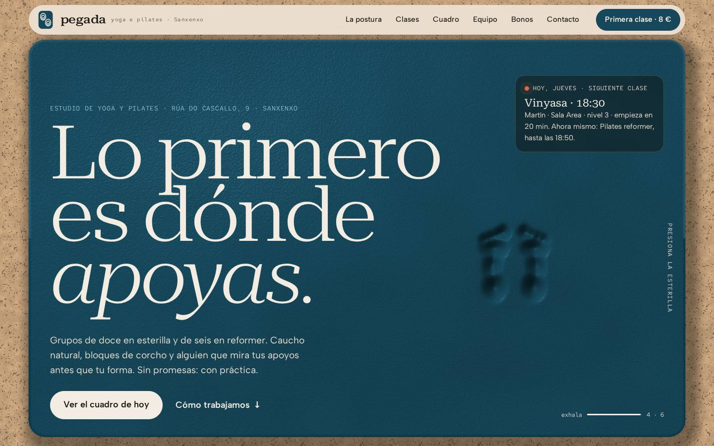

# Pegada · yoga e pilates — plantilla de demostración

> **Sitio de demostración. Pegada es un negocio ficticio; los datos,
> ilustraciones y opiniones son de muestra.** No existe ningún estudio con este
> nombre en Sanxenxo ni en la calle que figura en la web (Rúa do Cascallo, 9 es
> inventada). Teléfonos de ejemplo, correo en `.example`. Todas las páginas
> llevan `noindex, nofollow`.

Plantilla de la biblioteca de negocios ficticios para el sector **estudio de
yoga y pilates**, registro visual **C — producto y textura**. HTML + CSS + un
`main.js`, sin build: se abre con un servidor estático cualquiera y se publica
tal cual en GitHub Pages. GSAP, ScrollTrigger y Lenis desde **jsDelivr**.



## Concepto: «Apoyos»

> Toda postura empieza por lo que toca el suelo.

Lo que de verdad se enseña en una clase de yoga o de pilates no es una forma
bonita: es **dónde apoyas y cuánto peso dejas en cada apoyo**. Manos y pies en
el perro boca abajo, cuatro puntos en cuadrupedia, uno solo en el árbol. El
profesor corrige apoyos; la esterilla los recibe.

Así que la web es **una esterilla que recuerda dónde la has pisado**: un
material blando (caucho natural sobre suelo de corcho) que se hunde donde
presionas y recupera la forma despacio, como la espuma de verdad. Todo lo demás
cuelga de ahí:

- la **portada** es esa superficie, en WebGL: el cursor la roza, el clic la
  hunde, y al entrar y al bajar se marcan solas las huellas de los pies y de las
  manos de la primera postura;
- la **secuencia anclada** monta una postura apoyo a apoyo, con el reparto de
  peso en cifras y la esterilla cediendo bajo cada apoyo;
- los **niveles** se cuentan en apoyos (cuatro, tres, uno);
- los **tipos de clase** se explican por el material con el que se trabaja;
- el **cursor** deja una huella al pulsar;
- la **cortina** es la esterilla que se enrolla.

La respiración marca el tiempo: la superficie se hincha y el titular se ensancha
(eje `wdth` de la tipografía variable) en un ciclo de 4 s de inhalación y 6 s de
exhalación, el mismo que se usa en clase.

**Por qué no es el balneario.** «Grados» (As Caldeiras) trabaja temperatura y
un tinte que recorre la página; aquí no hay agua ni calor: hay **materia y
presión**. Paleta de corcho y caucho, no de piedra y cobre; tipografía ancha que
respira, no Cormorant.

**Por qué no es el tópico zen.** Ni loto, ni mandala, ni degradado lila, ni
piedras apiladas, ni promesas de «sanar». Corcho, caucho, lana y cifras.

## Qué hace esta mejor que las anteriores

Revisadas antes de diseñar las fichas de **As Caldeiras** (balneario, «Grados»),
**VINTE QUILOS** (gimnasio, «Carga»), **Ouzande** (abogacía, «Trinquete») y
**Olería Rañal** (cerámica, «Merma»):

1. **El hero es un material que se deforma, no un fondo que se mueve.** VINTE
   QUILOS lleva magnesio en suspensión; Trinquete, un mecanismo que gira solo.
   Aquí el visitante **hunde** la superficie: simulación de altura en GPU
   (ping-pong de dos texturas, en coma flotante de 16 bits si la tarjeta lo
   permite y en 8 bits con decaimiento por resta si no), recuperación
   viscoelástica y normales calculadas en el shader para iluminarla. Lo que hace
   el cursor se queda unos segundos, como en una esterilla de verdad. El color
   del caucho y del corcho sale de las variables CSS, así que el control de
   paleta recolorea también el WebGL.
2. **La narrativa anclada usa cinemática, no fotos ni piezas sueltas.** Una
   figura articulada (longitudes de segmento fijas, ángulos absolutos
   interpolados por el camino corto) pasa por cinco posturas con scrub. Lo más
   bajo de la figura se posa solo en la esterilla en cada fotograma, la
   esterilla de perfil se hunde bajo cada apoyo en proporción al peso, y la
   vista desde arriba enciende las huellas con **el porcentaje de peso de cada
   una**. Ramalleira monta un ramo; RODADURA separa piezas; ninguna calcula una
   postura.
3. **El cuadro de clases está vivo de verdad.** Marca el día de hoy (con la
   hora de Sanxenxo, esté donde esté quien mira), la clase en curso con lo que
   le queda y la siguiente con cuenta atrás —también si es mañana o el lunes—,
   y se recalcula cada 30 s. Es contenido, así que funciona **igual sin GSAP y
   con movimiento reducido**. VINTE QUILOS tenía cuadro, pero estático.
4. **Rendimiento y accesibilidad medidos desde el principio, no al final.**
   `PerformanceObserver` de `longtask` desde el `<head>` (`window.__longtasks`),
   bucle de WebGL que duerme fuera de pantalla y con la pestaña oculta, auditoría
   **axe a cero** en seis estados (ver `AUDITORIA.md`) y **44 comprobaciones**
   automáticas en `scripts/verifica.js`.
5. **La receta de borrado de los mandos es un script**, no una lista: deja la
   copia del cliente en cualquiera de las seis combinaciones (dos densidades ×
   tres paletas) y se niega a escribir si un archivo pierde más líneas de las
   previstas.

## Mapa de secciones

Nueve piezas, distinta en orden, número y forma de las registradas:

| # | Pieza | Forma |
|---|---|---|
| — | Cortina | La esterilla se enrolla de abajo arriba: el rollo engorda al subir (`expo.inOut`, borde curvo) |
| 1 | Portada | Esterilla WebGL a sangre sobre corcho, titular enorme abajo a la izquierda, tarjeta «siguiente clase» arriba a la derecha, respiración abajo a la derecha |
| 2 | La postura | Anclada (≈3,6 pantallas de scrub), oscura: figura de perfil + esterilla desde arriba + reparto de peso + texto del paso |
| 3 | Cinta | «inhala · sostén · exhala · apoya» en contorno, velocidad ligada al scroll |
| 4 | Clases | Columna fija a la izquierda (titular, niveles en apoyos), pila sticky de cinco materiales a la derecha |
| 5 | Cuadro | Seis columnas (una por día), hoy en color de marca, en curso con filete coral, siguiente en coral; filtros por tipo |
| 6 | Equipo | Cuatro retratos ilustrados en zigzag, el primero junto al titular; cita de muestra |
| 7 | Bonos | Vale de primera clase (8 €) inclinado como un papel apoyado, tarifas con conmutador esterilla/reformer |
| 8 | Antes de venir | «Lo que no prometemos» + preguntas en `<details>` |
| 9 | Contacto | Datos y horario, mapa dibujado que solo carga Google bajo clic, formulario de muestra |

Transición entre secciones: el cuadro, los bonos y «antes de venir» llegan
**prensados** (recortados con esquinas redondas) y se expanden con el scroll.

## Paleta «corcho e caucho»

| Token | Valor | Uso |
|---|---|---|
| `--corcho` | `#C9A57E` | fondo principal (con grano de corcho procedural) |
| `--corcho-2` | `#B99268` | paneles sobre corcho |
| `--espuma` | `#F3ECE2` | superficies claras |
| `--caucho` | `#1D1A16` | tinta y secciones oscuras |
| `--caucho-2` | `#2A2520` | paneles oscuros |
| `--apagado-corcho` / `--apagado-espuma` / `--apagado-caucho` | `#3E2D1E` / `#5E4E3E` / `#BDAF9C` | texto secundario, uno por fondo (nunca `opacity`) |
| `--mar` | `#16475A` | acento de marca: la esterilla (superficie, botones) |
| `--mar-texto` | `#0F3A4A` | el acento cuando es texto sobre corcho |
| `--mar-claro` | `#8EC3D3` | el acento cuando es texto sobre caucho o sobre la esterilla |
| `--coral` | `#E2683F` | «en vivo» y apoyos (solo superficie, con texto caucho encima) |

**31 parejas** calculadas con `scripts/contraste.js` antes de cerrar el CSS: de
4,61:1 a 14,78:1; botones ≥ 8,47:1. Alternativas del control de paleta
(**granate** `#6A2A35` y **musgo** `#33491F`) derivadas rotando el matiz del
acento con la misma luminosidad; tinta, corcho y espuma no cambian, ni el logo.

## Tipografía

- **Roboto Serif** variable (ejes `wdth` 50–150, `wght` 200–800, `opsz`) para
  titulares: ancha, blanda, con mucho tacto en tamaños grandes, y con un eje de
  anchura que deja que el titular respire. Revisados €, ñ, tildes y « ».
- **Albert Sans** para el texto.
- **Red Hat Mono** para horas, cifras del cuadro y porcentajes de apoyo.

Ninguna de las tres sale en la biblioteca.

## Recursos de movimiento (PLIEGO §2: mínimo cinco; aquí nueve)

1. **Hero WebGL** propio del concepto e interactivo (cursor, clic, dedo, scroll) — *protagonista*.
2. **Galería anclada con scrub**: la postura en cinco pasos.
3. **Lenis** como único motor de scroll.
4. **Char-reveal** letra a letra que «inhala» (las letras llegan estrechas y se ensanchan), con `IntersectionObserver`.
5. **Sticky-stack** de clases, con el `<li>` como pegajoso y alto medido por JS.
6. **Marquee** con la velocidad y el sentido ligados al scroll.
7. **Botones magnéticos**.
8. **Cursor propio** contextual (punto + aro; aro discontinuo sobre la esterilla, más grande sobre enlaces, claro sobre fondos oscuros, huella al pulsar).
9. **Contadores** y transición «prensada» entre secciones; tipografía variable que respira.

La cortina no cuenta: es obligatoria.

## Control de maqueta: «Apoyos» y «Sobria»

Mando abajo a la izquierda, **solo con `?revision` en la dirección** (sin el
parámetro no aparece ni se aplica nada guardado).

- **Apoyos** (cargada): huellas en todas partes — dibujos de material en las
  tarjetas, huellas de nivel, rastro de huellas entre secciones, huellas en la
  cinta y huella del cursor al pulsar.
- **Sobria**: las huellas se quedan solo donde significan algo (la esterilla de
  la portada y la secuencia de la postura, que son el concepto). Donde había un
  dibujo manda el dato: **los minutos de cada clase en grande**. Y añade lo que
  la cargada no tiene: **una comparativa ritmo/quietud** de las cinco clases en
  barras, para elegir sin leer cinco fichas. Los valores salen de los `data-*`
  de cada tarjeta, no se repiten en el script.

## Control de paleta: Mar, Granate, Musgo

Mismo mando, tres botones. Cambia `--mar`, `--mar-osc`, `--mar-texto`,
`--mar-claro` y `--pasada`; la esterilla WebGL se recolorea sola. La elección
se guarda en `localStorage` (`pegada-paleta`, `pegada-densidad`) y se aplica en
el script bloqueante del `<head>`, así que al recargar no parpadea. El aviso de
cookies y el aviso legal lo dicen.

### Receta de borrado de los mandos (antes de entregar a un cliente)

**El mando NUNCA viaja al sitio de un cliente.** La receta es un script que
trabaja sobre una copia:

```sh
node scripts/quita-mandos.js --densidad=apoyos --paleta=mar --destino=../pegada-cliente
```

`--densidad` es `apoyos` o `sobria` (la que haya elegido el cliente) y
`--paleta`, `mar`, `granate` o `musgo`. Lo que hace, paso a paso, con anclas
exactas y comprobando cada escritura:

1. `index.html`: quita el bloque `MANDOS DE DEMOSTRACIÓN` del script del
   `<head>`, el bloque `MANDO DE DEMOSTRACIÓN` del final del `<body>` y la frase
   de modo revisión del aviso de cookies. Con `apoyos` quita además la
   comparativa (`<figure class="comparativa">`); con `sobria` deja la clase
   `densidad-sobria` fija en `<html>`.
2. `js/main.js`: quita el bloque `MANDO DE DEMOSTRACIÓN`.
3. `css/style.css`: quita el bloque `PALETAS DE DEMOSTRACIÓN` (y, si la paleta
   elegida no es `mar`, escribe sus valores en `:root`), el bloque del mando y
   las dos reglas de `.cookies-revision`; con `apoyos` quita el bloque de la
   versión sobria entera.
4. `legal.html`: quita la línea de `pegada-densidad` y `pegada-paleta`.
5. Comprueba que `main.js` compila y que no queda ni rastro (`mando`,
   `data-paleta`, `revision`, `pegada-paleta`…).

Probada en las seis combinaciones el 2026-10-02; dos de las copias se cargaron
en el navegador y funcionan sin errores.

## Reskinear para un estudio real (lo más valioso de este repo)

1. **Datos** — todo en `index.html`: nombre (`pegada` en logo, pie, `<title>`,
   og), dirección, teléfonos, correo, horario de recepción, `schema.org`
   (`SportsActivityLocation`, sin `aggregateRating` ni `review`), y el `q=` del
   mapa en `main.js` (busca `maps?q=`). Borra el sello de demostración y el
   comentario de arriba **solo** cuando sea un cliente real.
2. **Cuadro de clases** — se edita la tabla `S` de `scripts/cuadro.js`
   (hora, minutos, tipo, nivel) y los nombres de `T`, se ejecuta
   `node scripts/cuadro.js` y se pega la salida entre las marcas
   `CUADRO:inicio` y `CUADRO:fin` del `index.html`. El JS lee los `data-*`; no
   hay que tocarlo. Revisa el número de clases en `.cuadro-resumen`
   (`data-hasta`).
3. **Tipos de clase** — cada `<li class="pila-item">` lleva `data-intensidad` y
   `data-quietud` (1–5), que alimentan la comparativa de la versión sobria. Los
   dibujos de material están en línea y usan las clases `.prop-*`; si el estudio
   no tiene reformer, borra ese `<li>` (la pila se remide sola).
4. **Paleta** — cambia `--mar` y familia en `:root` (o usa el mando y la receta)
   y vuelve a pasar `node scripts/contraste.js`. El corcho del fondo y el del
   WebGL salen de `--corcho`.
5. **La esterilla** — `main.js`, bloque «La esterilla (WebGL)»: `decae`
   (0,9935) es lo que tarda en recuperarse, `huellaPie`/`huellaMano` dibujan
   las huellas automáticas y `marcaPostura` dice dónde. Si el cliente no quiere
   WebGL, quitando el `<canvas>` queda `.portada-respaldo`, que ya está
   preparado.
6. **La postura** — los cinco pasos son `P` (ángulos de la figura) y `M`
   (posición y % de cada apoyo desde arriba) en `main.js`. Para otra secuencia
   (por ejemplo, una de pilates), se cambian esas dos tablas y el texto de los
   `<li class="paso">`.
7. **Profesorado** — retratos SVG en línea; colores de piel, pelo y ropa en las
   clases `.r-*` del CSS.
8. **Precios** — en las dos `.tarifas-lista`. Quita «Precios de muestra,
   ficticios» solo con precios reales.
9. **og:image** — `scripts/og.html` es la fuente; `node scripts/og.js` regenera
   `img/og.png` y los iconos.
10. **Antes de publicar** — `node scripts/verifica.js` y `node scripts/axe.js`.

## Comprobaciones

- `node scripts/contraste.js` — contraste de las 31 parejas.
- `node scripts/verifica.js` — capturas de cada sección en 1440×900 y 390×844 y
  44 comprobaciones del §7 (cortina en los tres casos, sin GSAP, movimiento
  reducido, cookies, mando, densidades, paletas, menú móvil, mapa, pila sticky
  en pasos de 90 px, hero en 360×640 y 375×667, longtask en frío, marcadores).
- `node scripts/axe.js --axe=ruta/a/axe.min.js` — auditoría, escribe `AUDITORIA.md`.
- `node scripts/quita-mandos.js` — receta de borrado.

Todos necesitan la carpeta servida en `http://localhost:8765/`
(`npx http-server -p 8765 .`). La hora de prueba se fija con
`?ahora=2026-10-01T18:10` (jueves, una clase en curso y la siguiente a 20 min).

## Créditos

Sin fotografía: toda la obra gráfica (logo, esterilla, figura, huellas, cinco
dibujos de material, cuatro retratos, mapa dibujado, 404, og:image) es SVG o
shader propios. Detalle en [`CREDITOS.md`](CREDITOS.md).

## Decisiones tomadas

- **Sin foto, a propósito.** Un estudio de yoga con foto de archivo enseña
  cuerpos de catálogo; el concepto va de apoyos y de material, y eso se dibuja
  mejor de lo que se fotografía. Y evita poner la cara de alguien real a un
  profesorado que no existe.
- **El acento es el color de la esterilla, no el del estudio.** Azul atlántico
  oscuro porque es Sanxenxo y porque es el color de una esterilla de caucho
  real; nada de lila.
- **El mando solo existe con `?revision`.** Un cliente que abre la demo sin el
  parámetro ve la web limpia.
- **`?ahora=`** se queda en la plantilla: sirve para enseñar en una reunión
  cómo se ve el cuadro un lunes a primera hora o un domingo.
- **Edad mínima 16** en las preguntas frecuentes, y nada de menores en las
  ilustraciones (PLIEGO §4).
- **Ninguna promesa de salud.** Hay un bloque entero, «Lo que no prometemos», y
  el aviso legal lo repite.
